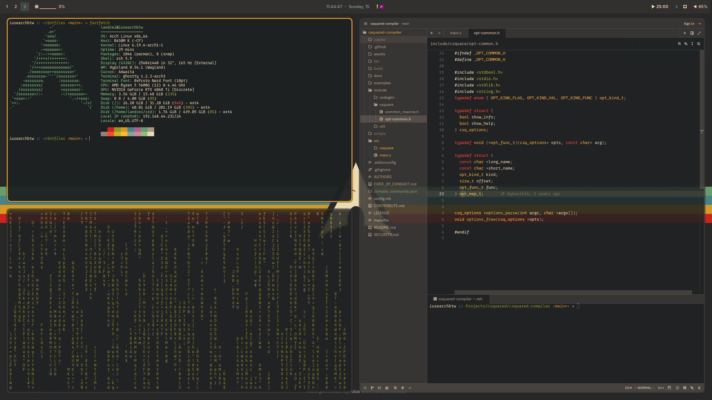
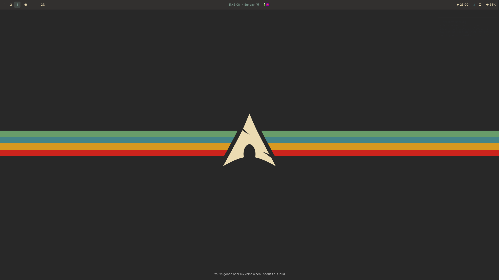

# Dotfiles

These are my personal dotfiles.

## Files

- **Hyrpland**: `./hypr`.
- **Ghostty**: `./ghostty/config`
- **Wallpapers**: `./walls`
- **Nvim/Zed configs**: `./nvim` and `./zed` respectively.
- **Waybar**: `./waybar`
- **Wofi**: `./wofi`

<!-- ## Preview -->
<!--  -->
<!--  -->

<!--  -->
<!--  -->
